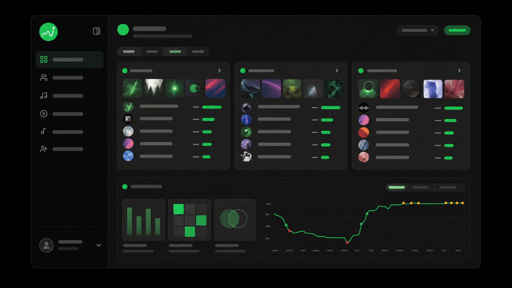
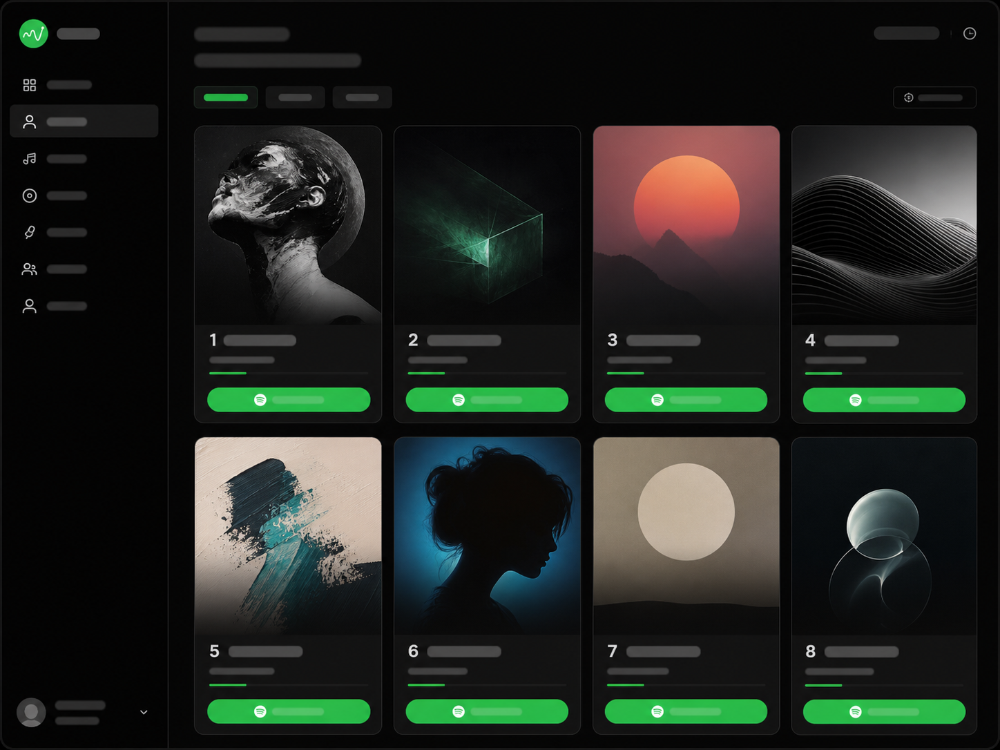
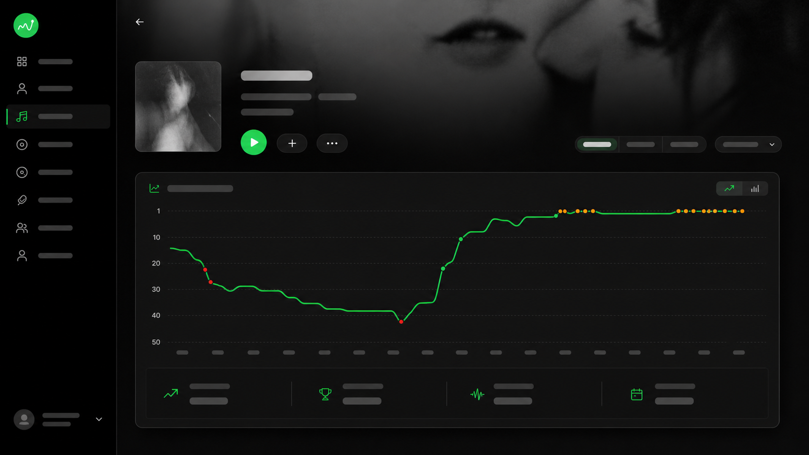
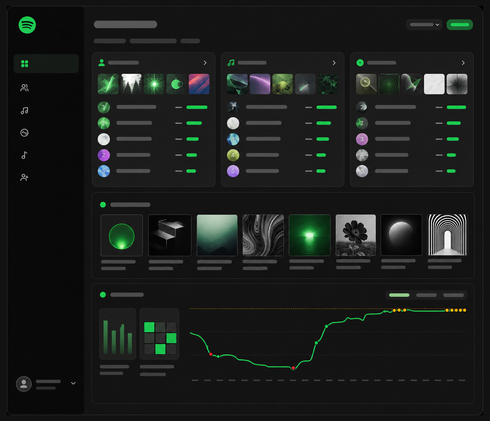

<div align="center">


# Stats for Spotify

**Your Spotify listening history, remembered.**

See your top artists, tracks, albums, and genres — then watch how they move over weeks, months, and years.

[**Open the app →**](https://statsforspotify-chi.vercel.app)

[](LICENSE)
[](https://nextjs.org)
[](https://supabase.com)
[](https://github.com/Berkay2002/statsforspotify/actions/workflows/sync-supabase-schema.yml)

[Features](#features) • [Screenshots](#screenshots) • [Getting started](#getting-started) • [How it works](#how-it-works)

</div>

---

Spotify shows you a top-50 list, but only for right now. Refresh next month and the old one is gone. **Stats for Spotify** saves a snapshot every time you visit, so your rankings become a timeline instead of a single frame — with charts, rank-change badges, and recaps that tell you what actually shifted. Sign in with Spotify and it starts tracking from your first visit.

## Features

### Your stats
- **Top artists, tracks, albums & genres** across three time ranges — last 4 weeks, last 6 months, and all time
- **Rank-change badges** — `↑5`, `↓3`, `NEW` inline on every list, so movement is visible at a glance
- **Trend charts** — ranking history plotted over time, with sparklines on list rows and tooltips like *"Rank 3 (was 8, ↑5)"*
- **Recaps** — album takeovers, hall-of-fame returns, and plot twists generated from your own history

### Social
- **Friends** — connect with people who mutually follow you on Spotify
- **Profiles** — a username with a Discord-style discriminator (`#0000`)
- **Privacy controls** — set your stats to public, friends-only, or private
- **Compare** — browse a friend's top artists and tracks, when they allow it

### Playback & control
- **In-app player** — preview tracks without leaving the page (Spotify Premium required, via the Web Playback SDK)

### Your data
- **Export** everything as JSON or CSV, any time
- **Delete** your data or your entire account with one click
- **Dark mode** by default, light mode on request, and a layout that works on a phone

> [!NOTE]
> This is an independent project. It is not affiliated with, endorsed by, or sponsored by Spotify AB.

## Screenshots

|                                             |                                             |
| ------------------------------------------- | ------------------------------------------- |
|  |  |
|  |  |

## Getting started

### Prerequisites

- [Bun](https://bun.sh) (recommended) or Node.js 18+
- A [Supabase](https://supabase.com) project
- A [Spotify Developer](https://developer.spotify.com/dashboard) app

### 1. Install

```bash
git clone https://github.com/Berkay2002/statsforspotify.git
cd statsforspotify
bun install
```

### 2. Set up Supabase

1. Create a project at [supabase.com](https://supabase.com).
2. Apply the schema in [`supabase/schema/schema.sql`](supabase/schema/schema.sql). Row Level Security is part of the schema — every table is locked to its owner.
3. Under **Authentication → Providers → Spotify**, paste your Spotify client ID and secret, and set the callback URL to `https://<your-project>.supabase.co/auth/v1/callback`.
4. In the Spotify dashboard, add that same callback URL as a redirect URI.

The app requests these scopes:

```
user-read-email  user-top-read  user-follow-read  user-follow-modify
streaming  user-modify-playback-state  user-read-playback-state
```

### 3. Configure environment

Create `.env.local` in the project root:

```env
NEXT_PUBLIC_SUPABASE_URL=your_supabase_project_url
NEXT_PUBLIC_SUPABASE_ANON_KEY=your_supabase_anon_key
```

> [!WARNING]
> `.env*` is gitignored. Never commit real keys — the anon key is public by design, but anything else belongs in your host's secret store.

### 4. Run it

```bash
bun run dev
```

Open <http://localhost:3000>.

## How it works

1. **Connect** — Spotify OAuth through Supabase starts the session.
2. **Read** — your top items, albums, genres, and profile load from the Spotify Web API.
3. **Snapshot** — ranking positions are written to Postgres, at most once every 24 hours.
4. **Compare** — charts, recaps, and friend views turn that stored movement into something readable.

Snapshots are triggered automatically when you open the dashboard. For a server-side schedule, the Supabase Edge Function in [`supabase/functions/collect-snapshots`](supabase/functions/collect-snapshots) can run on `pg_cron`, or any external cron can call `/api/snapshot`.

## Tech stack

| Layer      | Choice                                                      |
| ---------- | ----------------------------------------------------------- |
| Framework  | Next.js 16 (App Router) + React 19                          |
| Database   | Supabase — Postgres, Auth, Edge Functions, RLS on all tables |
| Styling    | Tailwind CSS v4 + shadcn/ui, Lucide icons                   |
| Charts     | Recharts v3                                                 |
| State      | TanStack Query v5                                           |
| Animation  | Framer Motion                                               |
| Runtime    | Bun (or Node.js 18+), deployed on Vercel                    |

## Project structure

```
app/
  (public)/     Landing, auth callback, privacy, terms
  (protected)/  Dashboard, profile — auth required
  api/          Snapshots, rankings, friends, artists, user data
components/
  ui/           shadcn/ui primitives
  charts/       Sparklines and ranking charts
  recaps/       Album takeover, hall of fame, plot twists
lib/
  spotify/      Spotify API layer and types
  supabase/     Clients and generated types
supabase/
  schema/       Authoritative schema.sql
  functions/    Edge Functions
proxy.ts        Auth middleware for protected routes
```

## Scripts

| Command                        | What it does                           |
| ------------------------------ | -------------------------------------- |
| `bun run dev`                  | Start the dev server                   |
| `bun run build`                | Production build                       |
| `bun run start`                | Serve the production build             |
| `bun run lint`                 | ESLint                                 |
| `bun run validate:schema-sync` | Check generated types match the schema |

> [!TIP]
> `lib/supabase/database.ts` is generated from the database — don't edit it by hand. A daily GitHub Action keeps it and `schema.sql` in sync; see [docs/schema-sync.md](docs/schema-sync.md).

## Deploying

Deploy to [Vercel](https://vercel.com/new), set the two `NEXT_PUBLIC_SUPABASE_*` variables in the project settings, then add your production domain to both the Spotify app's redirect URIs and Supabase's allowed redirect URLs.
